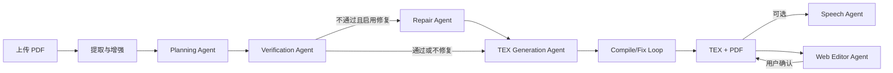

# Agent 工作原理与协作说明

## 总体模型

系统不是让多个 Agent 自由对话，而是由 `backend/pipeline.py` 按固定顺序编排。每个 Agent 读取上一步的结构化产物，输出新的 JSON、TEX 或 PDF；作业状态和 artifact 路径写入 SQLite。这样可以重试单个阶段、展示进度并保留可审计的中间结果。

## 单个 Agent

### 提取与增强

`backend/services/paper_extractor.py` 调用 `layout_extractor.py`。Marker/Surya 负责布局、正文和图片提取；模型不可用时降级为 PyMuPDF 文本提取。启用 LLM enhancement 后，再抽取表格、公式和演示摘要。输出是 raw content JSON 与会话图片目录。它更接近确定性工具加 LLM 增强器，是后续 Agent 的事实来源。

### Planning Agent

`backend/agents/planning.py` 分三步调用模型：识别论文元信息，提取贡献/方法/结果等关键内容，再生成逐页 `slides_plan`。输入只来自 raw content；输出包含 `paper_info`、`key_content`、每页标题、要点和图片引用。它负责内容选择与叙事结构，不生成 LaTeX。

### Verification Agent

`backend/agents/verification.py` 对照 raw content 和 plan，评估问题动机、贡献、方法、结果及结论的覆盖度，输出分数、缺失项、重要性和修复建议。它只判断，不直接修改 plan，避免“检查者同时改答案”。

### Repair Agent

`backend/agents/repair.py` 只处理 Verification Agent 报告的高价值缺口。它回到 raw content 取证，把补充要点插入匹配页面，必要时增加补充页，并输出 repaired plan。自动修复发生在 TEX 生成前；网页 One-click repair 也会在修复后重新验证并重新生成 TEX/PDF。

### TEX Generation Agent

`backend/agents/tex_generation.py` 把最终 plan 转为完整 Beamer 文档，应用语言、主题、图片引用和特殊字符规则。`backend/services/tex_workflow.py` 统一图片路径并保存 `output.tex`。该 Agent 负责表现层，不重新解释论文事实。

### Compile/Fix Loop

`backend/services/tex_compiler.py` 在临时目录中编译 TEX，复制会话图片并规范 `includegraphics`。失败时提取 LaTeX 错误，交给模型做最小修复，最多重试配置次数。这是“工具验证—Agent 修复”的闭环；只有真实编译成功才发布 PDF。

### Speech Agent

`backend/agents/speech.py` 读取最终 plan，并可参考 raw content，根据时长、场景、受众和语言生成逐页讲稿。它是可选分支，不影响幻灯片主链路。

### Web Editor Agent

`backend/agents/editor.py` 接收当前完整 TEX、用户要求和有限的原文上下文，返回完整 proposed TEX、摘要和 unified diff。提议先保存为 pending edit；只有用户点击接受后才覆盖当前 TEX，之后还需重新编译。这一确认边界防止自然语言修改直接破坏已生成文件。

## 多 Agent 如何合作

协作依赖三条约束：第一，raw content 是事实源，plan 是内容契约，TEX 是表现产物；Agent 不跨层写入。第二，Verification 与 Repair 分离，并在手工修复后再次验证。第三，LLM provider/model 由 `llm_provider_context` 在单个作业范围内注入，所有阶段使用同一作业配置，避免并发作业互相污染环境变量。

任一必要阶段失败，作业会进入 `failed` 并保留已有 artifact；可选 Speech Agent 失败不会阻止主 PDF 交付。Editor Agent 独立于生成流水线，始终通过“提议—确认—重新编译”与主产物协作。
